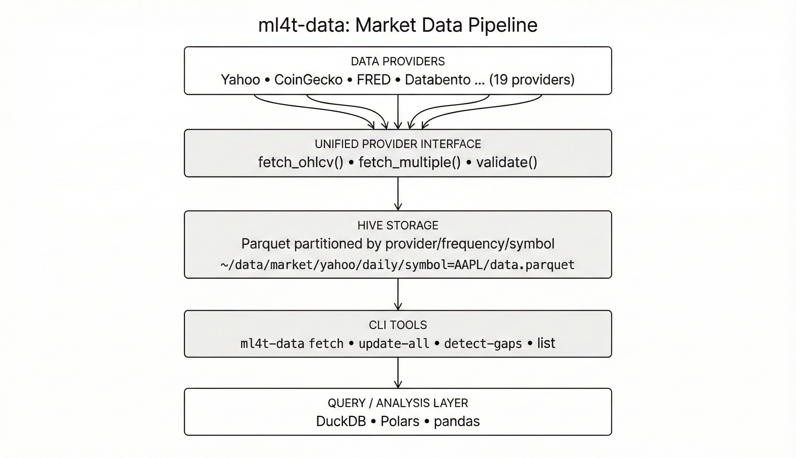

# ml4t-data

[](https://www.python.org/downloads/)
[](https://pypi.org/project/ml4t-data/)
[](https://opensource.org/licenses/MIT)

Unified market data acquisition and storage for quantitative research workflows.

## Part of the ML4T Library Ecosystem

This library is one of five interconnected libraries supporting the machine learning for trading workflow described in [Machine Learning for Trading](https://mlfortrading.io):


Each library addresses a distinct stage: data infrastructure, feature engineering, signal evaluation, strategy backtesting, and live deployment.

## What This Library Does

Quantitative research requires consistent, reproducible access to market data from multiple sources. ml4t-data provides:

- A unified interface across 19 data providers (equities, crypto, forex, futures, economic data)
- Automated storage in Hive-partitioned Parquet format with metadata tracking
- Incremental updates, gap detection, and backfill capabilities via CLI
- Built-in data validation (OHLC invariants, deduplication, anomaly detection)

The goal is to support an ongoing research workflow rather than one-off downloads. Data is stored locally, tracked for freshness, and queryable with tools like DuckDB or Polars.



## Installation

```bash
pip install ml4t-data
```

## Quick Start

```python
from ml4t.data.providers import YahooFinanceProvider

provider = YahooFinanceProvider()
data = provider.fetch_ohlcv("AAPL", "2020-01-01", "2024-12-31")
print(data.head())
```

All providers implement the same interface:

```python
from ml4t.data.providers import CoinGeckoProvider, FREDProvider

# Crypto
crypto = CoinGeckoProvider().fetch_ohlcv("bitcoin", "2024-01-01", "2024-12-31")

# Economic data
fred = FREDProvider().fetch_series("GDP", "2020-01-01", "2024-12-31")
```

## Data Providers

### Free (No API Key)

| Provider | Coverage |
|----------|----------|
| Yahoo Finance | US/global equities, ETFs, crypto, forex |
| CoinGecko | 10,000+ cryptocurrencies |
| FRED | 850,000 economic series |
| Fama-French | Academic factor data |
| AQR | Alternative factors (QMJ, BAB, TSMOM) |

### API Key Required

| Provider | Coverage |
|----------|----------|
| EODHD | 60+ global exchanges |
| Tiingo | US equities with quality focus |
| Twelve Data | Multi-asset coverage |
| Alpha Vantage | Equities, forex, crypto |
| Databento | CME, CBOE, ICE futures/options |
| Polygon | US equities, options, forex, crypto |
| Finnhub | 70+ global exchanges |
| Binance | Crypto exchange data |
| OANDA | Forex broker data |

## CLI for Automated Updates

```bash
# Fetch specific symbols
ml4t-data fetch AAPL MSFT GOOGL --provider yahoo --start 2020-01-01

# Configuration-driven batch updates
ml4t-data update-all -c config.yaml

# Detect and fill gaps
ml4t-data update-all -c config.yaml --detect-gaps
```

Configuration example:

```yaml
storage:
  path: ~/data/market

datasets:
  sp500_daily:
    provider: yahoo
    symbols_file: symbols/sp500.txt
    frequency: daily
    start_date: 2015-01-01

  crypto:
    provider: coingecko
    symbols: [bitcoin, ethereum, solana]
    frequency: daily
    start_date: 2020-01-01
```

## Storage Format

Data is stored in Hive-partitioned Parquet:

```
~/data/market/
├── yahoo/daily/symbol=AAPL/data.parquet
├── yahoo/daily/symbol=MSFT/data.parquet
└── coingecko/daily/symbol=bitcoin/data.parquet
```

Query with DuckDB or Polars:

```python
import duckdb

result = duckdb.execute("""
    SELECT * FROM read_parquet('~/data/market/yahoo/daily/**/*.parquet')
    WHERE symbol IN ('AAPL', 'MSFT')
    AND date >= '2024-01-01'
""").pl()
```

## Data Validation

```python
from ml4t.data.validation import validate_ohlcv

issues = validate_ohlcv(data)
# Checks: high >= low, high >= open/close, low <= open/close
# Detects: duplicates, gaps, anomalies
```

## Technical Characteristics

- **Polars-based**: Native Polars DataFrames throughout
- **Consistent schema**: All providers return the same column structure
- **Metadata tracking**: Last update timestamps, row counts, date ranges

## Related Libraries

- **ml4t-engineer**: Feature engineering and technical indicators
- **ml4t-diagnostic**: Signal evaluation and statistical validation
- **ml4t-backtest**: Event-driven backtesting
- **ml4t-live**: Live trading with broker integration

## Development

```bash
git clone https://github.com/applied-ai/ml4t-data.git
cd ml4t-data
uv sync
uv run pytest tests/ -q
uv run ty check
```

## License

MIT License - see [LICENSE](LICENSE) for details.
